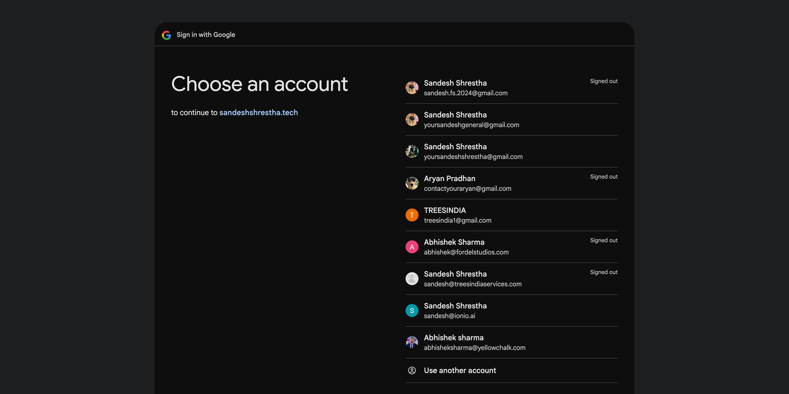
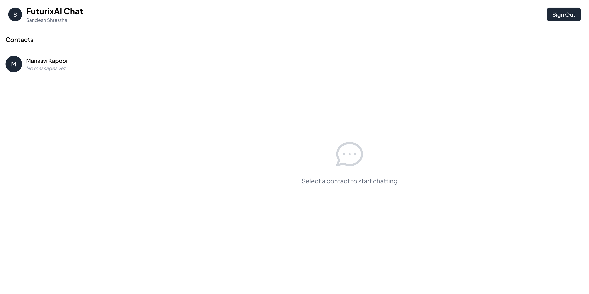
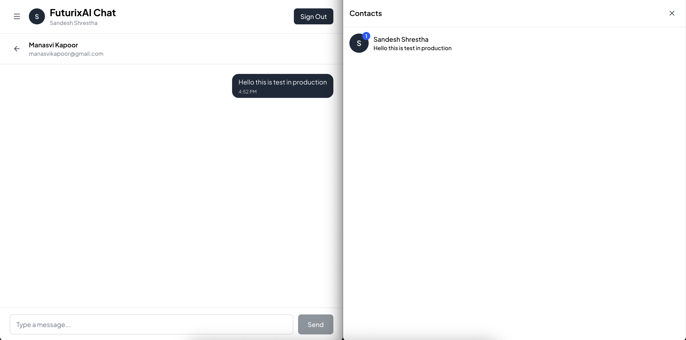
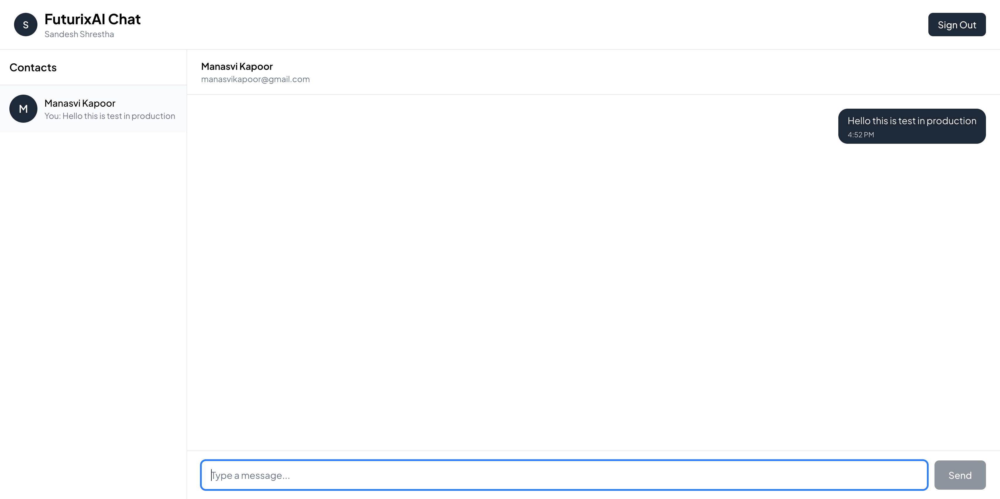
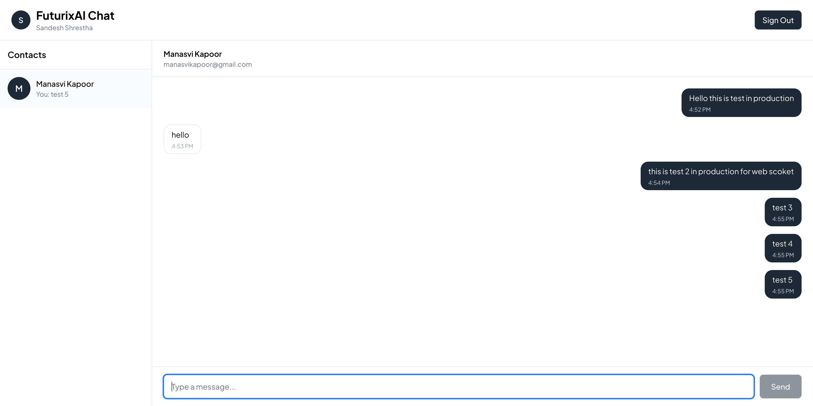

# FuturixAI - Real-Time Chat Application

Real-time chat application built with Next.js 15, TypeScript, WebSocket, and PostgreSQL. Features include instant messaging, typing indicators, read receipts, and multiple authentication methods.

---

## Assignment Requirements Fulfillment

This project was built as a technical assessment for FuturixAI. Below is how each requirement has been implemented:

| Requirement          | Implementation                                                   | Status      |
| -------------------- | ---------------------------------------------------------------- | ----------- |
| **Framework**        | Next.js 15.5.6 with App Router                                   | ✅ Complete |
| **Database/ORM**     | PostgreSQL + Prisma with migrations                              | ✅ Complete |
| **Real-time**        | Self-hosted WebSocket server (custom Node.js + ws library)       | ✅ Complete |
| **Persistence**      | Messages stored in Postgres, reloaded on page refresh            | ✅ Complete |
| **Seed Data**        | Two demo users pre-configured for testing                        | ✅ Complete |
| **Environment**      | `.env.example` provided with all required variables              | ✅ Complete |
| **Containerization** | Complete Docker setup with `Dockerfile` and `docker-compose.yml` | ✅ Complete |
| **OAuth**            | Google & GitHub OAuth + credential fallback for seeded users     | ✅ Complete |

### Core Features Beyond Requirements

While the assignment focused on functionality over UI, the following enhancements were added to demonstrate best practices:

- **TypeScript**: Full type safety across the entire application
- **Real-time Typing Indicators**: Shows when the other user is typing (debounced)
- **Read Receipts**: Marks messages as read with real-time updates
- **Unread Message Counter**: Visual indicator for unread messages
- **Optimistic UI Updates**: Immediate feedback before server confirmation
- **Responsive Design**: Mobile-first approach with clean, modern UI
- **Error Handling**: Comprehensive error handling at all layers
- **Security**: bcrypt password hashing, JWT sessions, input validation

---

## Screenshots

### Login Page


_Clean and modern authentication interface with multiple sign-in options_

### Google OAuth Sign-In


_Seamless Google OAuth integration_

### Main Chat Dashboard


_Real-time messaging interface with user list and chat area_

### New Message


_Sending messages with instant delivery_

### Message Testing


_Testing real-time message delivery and read receipts_

### Full Application View


_Complete application layout showcasing all features_

---

## Table of Contents

- [Assignment Requirements Fulfillment](#assignment-requirements-fulfillment)
- [Screenshots](#screenshots)
- [Tech Stack](#tech-stack)
- [Architecture Overview](#architecture-overview)
- [Key Features](#key-features)
- [Project Structure](#project-structure)
- [Database Schema](#database-schema)
- [API Routes](#api-routes)
- [WebSocket Implementation](#websocket-implementation)
- [Authentication Flow](#authentication-flow)
- [Setup & Installation](#setup--installation)
- [Environment Variables](#environment-variables)
- [Docker Deployment](#docker-deployment)
- [Technical Decisions](#technical-decisions)
- [Performance Optimizations](#performance-optimizations)
- [How to Test](#how-to-test)

---

## Tech Stack

### Frontend

- **Next.js 15.5.6** - React framework with App Router
- **React 19** - UI library
- **TypeScript** - Type safety
- **Tailwind CSS 4** - Utility-first CSS framework
- **Framer Motion** - Animation library
- **Lucide React** - Icon library

### Backend

- **Next.js API Routes** - RESTful endpoints
- **Custom WebSocket Server** - Real-time communication
- **NextAuth.js** - Authentication
- **Prisma ORM** - Database toolkit
- **PostgreSQL** - Relational database

### Additional Tools

- **bcryptjs** - Password hashing
- **ws** - WebSocket library
- **Docker** - Containerization
- **ESLint** - Code linting

---

## Architecture Overview

### Three-Layer Architecture

```
┌─────────────────────────────────────────────────────────────┐
│                     PRESENTATION LAYER                       │
│  Next.js App Router • React Components • TailwindCSS        │
│  Client-side State Management • WebSocket Client            │
└─────────────────────────────────────────────────────────────┘
                              ↕
┌─────────────────────────────────────────────────────────────┐
│                     APPLICATION LAYER                        │
│  Next.js API Routes • NextAuth.js • Custom Hooks            │
│  WebSocket Server (ws library) • Business Logic             │
└─────────────────────────────────────────────────────────────┘
                              ↕
┌─────────────────────────────────────────────────────────────┐
│                        DATA LAYER                            │
│  Prisma ORM • PostgreSQL Database • Migration System        │
└─────────────────────────────────────────────────────────────┘
```

### Hybrid Communication Pattern

- **HTTP/REST** - Initial data fetching, authentication, CRUD operations
- **WebSocket** - Real-time messaging, typing indicators, live updates

---

## Key Features

### 1. **Multi-Provider Authentication**

- Email/Password credentials with bcrypt hashing
- Google OAuth 2.0 integration
- GitHub OAuth integration
- JWT-based session management
- Demo account quick access

### 2. **Real-Time Messaging**

- Instant message delivery via WebSocket
- Message persistence in PostgreSQL
- Online/offline user status
- Message history with infinite scroll capability

### 3. **User Experience**

- Typing indicators (debounced)
- Read receipts with real-time updates
- Unread message counters
- Last message preview in user list
- Responsive design (mobile-first)

### 4. **Performance Features**

- Optimistic UI updates
- Efficient database indexing
- Connection state management
- Automatic WebSocket reconnection
- Sorted user list by recent activity

---

## Project Structure

```
futurixai/
├── prisma/
│   ├── schema.prisma           # Database schema
│   ├── seed.ts                 # Seed data for development
│   └── migrations/             # Database migrations
├── src/
│   ├── app/
│   │   ├── api/
│   │   │   ├── auth/[...nextauth]/   # NextAuth handler
│   │   │   ├── messages/             # Message CRUD
│   │   │   │   └── read/             # Mark as read
│   │   │   └── users/                # User list endpoint
│   │   ├── auth/signin/        # Sign-in page
│   │   ├── chat/               # Main chat interface
│   │   ├── layout.tsx          # Root layout
│   │   ├── page.tsx            # Landing page (redirect logic)
│   │   └── globals.css         # Global styles
│   ├── components/
│   │   ├── chat/               # Chat UI components
│   │   │   ├── ChatArea.tsx
│   │   │   ├── ChatHeader.tsx
│   │   │   ├── EmptyState.tsx
│   │   │   ├── MessageBubble.tsx
│   │   │   ├── MessageInput.tsx
│   │   │   ├── Sidebar.tsx
│   │   │   ├── TypingIndicator.tsx
│   │   │   └── UserListItem.tsx
│   │   └── providers/
│   │       └── SessionProvider.tsx
│   ├── hooks/
│   │   ├── useWebSocket.ts     # WebSocket connection hook
│   │   └── useTypingIndicator.ts # Typing logic hook
│   ├── lib/
│   │   ├── auth.ts             # NextAuth configuration
│   │   └── prisma.ts           # Prisma client instance
│   ├── types/
│   │   ├── chat.ts             # TypeScript interfaces
│   │   └── next-auth.d.ts      # NextAuth type extensions
│   └── utils/
│       └── chat.ts             # Helper functions
├── server.ts                   # Custom server with WebSocket
├── docker-compose.yml          # Development environment
├── docker-compose.prod.yml     # Production environment
├── Dockerfile                  # Production image
├── Dockerfile.dev              # Development image
├── package.json                # Dependencies
└── tsconfig.json               # TypeScript configuration
```

---

## Database Schema

### User Model

```prisma
model User {
  id        String   @id @default(uuid())
  email     String   @unique
  name      String?
  password  String?                    // Hashed with bcrypt
  image     String?                    // Profile picture URL
  provider  String?  @default("credentials")
  createdAt DateTime @default(now())
  updatedAt DateTime @updatedAt

  sentMessages     Message[] @relation("SentMessages")
  receivedMessages Message[] @relation("ReceivedMessages")
}
```

### Message Model

```prisma
model Message {
  id         String   @id @default(uuid())
  content    String
  senderId   String
  receiverId String
  read       Boolean  @default(false)
  createdAt  DateTime @default(now())

  sender   User @relation("SentMessages", fields: [senderId], references: [id])
  receiver User @relation("ReceivedMessages", fields: [receiverId], references: [id])

  @@index([senderId])           // Optimize sender queries
  @@index([receiverId])         // Optimize receiver queries
  @@index([createdAt])          // Optimize time-based sorting
}
```

### Relationships

- One-to-Many: User → SentMessages
- One-to-Many: User → ReceivedMessages
- Cascade Delete: Deleting a user removes all their messages

---

## API Routes

### 1. **Authentication** - `/api/auth/[...nextauth]`

**Methods**: `GET`, `POST`  
**Purpose**: NextAuth.js catch-all route  
**Features**:

- Handles sign-in, sign-out, callbacks
- JWT token generation
- OAuth provider callbacks
- Session management

---

### 2. **Messages** - `/api/messages`

#### GET - Fetch Messages

**Query Parameters**:

- `otherUserId`: (required) ID of the other user in conversation

**Response**:

```typescript
Message[] {
  id: string;
  content: string;
  senderId: string;
  receiverId: string;
  read: boolean;
  createdAt: string;
  sender: { id, name, email, image };
  receiver: { id, name, email, image };
}
```

**Logic**:

- Authenticated users only
- Fetches bidirectional messages between two users
- Sorted by `createdAt` ascending
- Includes full sender/receiver details

#### POST - Send Message

**Body**:

```json
{
  "content": "Hello!",
  "receiverId": "user-uuid"
}
```

**Response**: Created message object with relations

---

### 3. **Mark Messages as Read** - `/api/messages/read`

**Method**: `POST`  
**Body**:

```json
{
  "otherUserId": "user-uuid"
}
```

**Logic**:

- Marks all unread messages from `otherUserId` as read
- Bulk update using Prisma `updateMany`
- Returns count of updated messages

---

### 4. **Users List** - `/api/users`

**Method**: `GET`  
**Purpose**: Fetch all users with conversation metadata

**Response**:

```typescript
User[] {
  id: string;
  name: string | null;
  email: string;
  image: string | null;
  createdAt: Date;
  lastMessage?: {
    content: string;
    createdAt: Date;
    isOwn: boolean;
  };
  unreadCount?: number;
}
```

**Logic**:

1. Fetch all users except current user
2. For each user, get:
   - Last message in conversation
   - Count of unread messages
3. Sort by most recent message first
4. Return enriched user list

---

## WebSocket Implementation

### Custom Server (`server.ts`)

```typescript
// WebSocket endpoint: ws://localhost:3000/api/ws
const wss = new WebSocketServer({ noServer: true });
```

### Message Types

#### 1. **Authentication**

```json
{
  "type": "auth",
  "userId": "user-uuid"
}
```

#### 2. **Send Message**

```json
{
  "type": "message",
  "content": "Hello!",
  "receiverId": "user-uuid"
}
```

#### 3. **Typing Indicator**

```json
{
  "type": "typing",
  "receiverId": "user-uuid"
}
```

#### 4. **Read Receipt**

```json
{
  "type": "read",
  "messageId": "message-uuid",
  "senderId": "user-uuid"
}
```

### Client Management

- **Connection Map**: `Map<userId, WebSocket>`
- **Authentication**: Required on connection
- **Cleanup**: Auto-remove on disconnect
- **Error Handling**: Try-catch with error messages

### Message Flow

```
User A                    Server                     User B
  │                         │                          │
  ├──WebSocket Connect──────>                         │
  ├──{type: "auth"}──────────>                         │
  │                         ├──Store in clients Map   │
  │                         │                          │
  ├──{type: "message"}───────>                         │
  │                         ├──Save to DB             │
  │                         ├──Forward via WS──────────>
  │                         │                          │
  │<──────────────────────────────{type: "typing"}─────┤
  │                         │                          │
```

---

## Authentication Flow

### Credentials Flow

```
1. User submits email/password
2. NextAuth calls authorize function
3. Fetch user from database
4. Compare password with bcrypt
5. Generate JWT token
6. Create session
7. Redirect to /chat
```

### OAuth Flow (Google/GitHub)

```
1. User clicks OAuth button
2. Redirect to provider
3. User grants permission
4. Provider redirects with code
5. NextAuth exchanges code for token
6. Fetch user info from provider
7. Check if user exists in DB
   - If yes: Use existing user
   - If no: Create new user
8. Generate JWT token
9. Create session
10. Redirect to /chat
```

### Session Management

- **Strategy**: JWT (stateless)
- **Storage**: HTTP-only cookie
- **Expiration**: 30 days (configurable)
- **Refresh**: Automatic on requests

---

## Demo Accounts

As per assignment requirements, exactly two demo users are seeded for testing:

**Account 1**:

- Email: `sandeshshrestha@gmail.com`
- Password: `password123`

**Account 2**:

- Email: `manasvikapoor@gmail.com`
- Password: `password123`

These accounts are automatically created when running `npm run prisma:seed` or when using Docker Compose.

---
